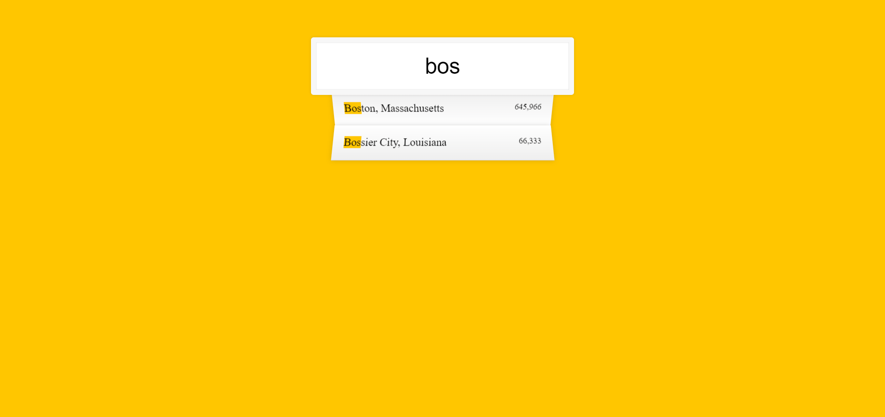
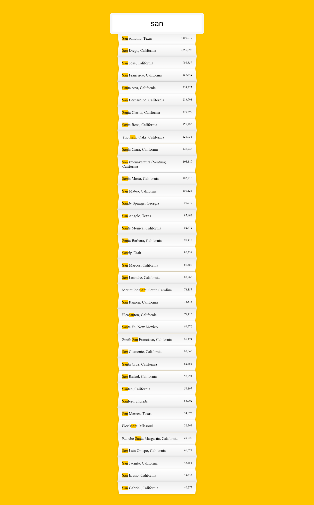

# 06---Type-Ahead
This is day 6 of the 30 days of the JS challenge. 
In this challenge, data of 1000 cities is fetched from the URL and stored in an array and whenever a user starts typing in the search box,
the cities containing typed phrases are displayed on the UI.

## Project Screenshots

## Live Link
[Click Here](https://psargar616.github.io/06---Type-Ahead/)

## Learned to 
- fetch data from the URL
- filtering data using filter()
- use map()
- adding commas to numbers

